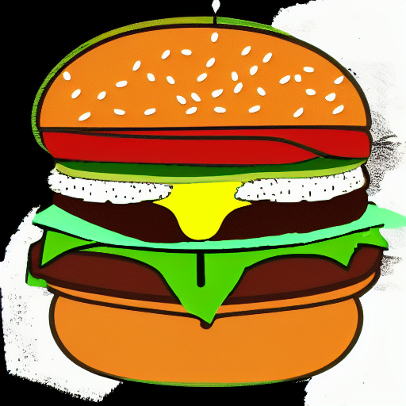
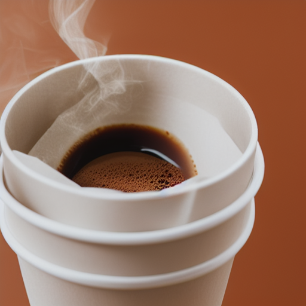
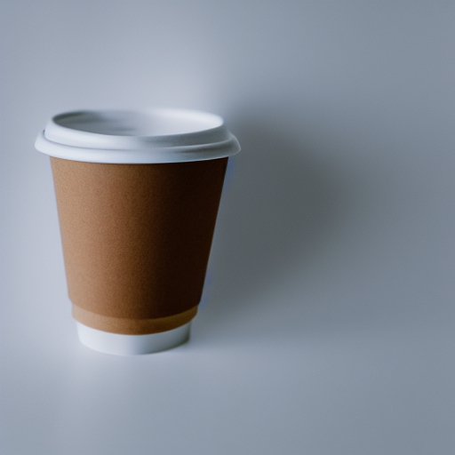
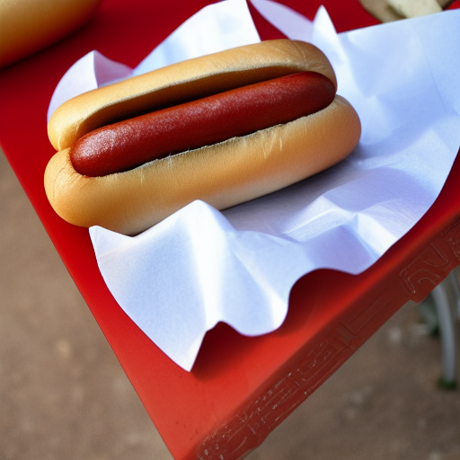

<link rel="apple-touch-icon" sizes="180x180" href="./apple-touch-icon.png">
<link rel="icon" type="image/png" sizes="32x32" href="./favicon-32x32.png">
<link rel="icon" type="image/png" sizes="16x16" href="./favicon-16x16.png">
<link rel="manifest" href="./site.webmanifest">
<link rel="mask-icon" href="./safari-pinned-tab.svg" color="#5bbad5">
<meta name="msapplication-TileColor" content="#2b5797">
<meta name="theme-color" content="#ffffff">
<meta name="viewport" content="width=device-width, initial-scale=1"/>
<link rel="stylesheet" href="styles.css"/>

<section class="hero">

# Alberts coffee

Oldest coffee on the east coast

[order coffee](#products)

</section>

<section id="products">

## Fresh coffee [£5.00](?fresh#Checkout)

## Takeaway coffee [£5.00](?takeaway#Checkout)

> What can be better than some morning coffee? 😃

## Hot dog [£7.00](?hotdog#Checkout)

</section>

<section class="popup">

-->
## Checkout
[>_ "name"]
[>_ "phone"]
[submit]
-->

</section>
