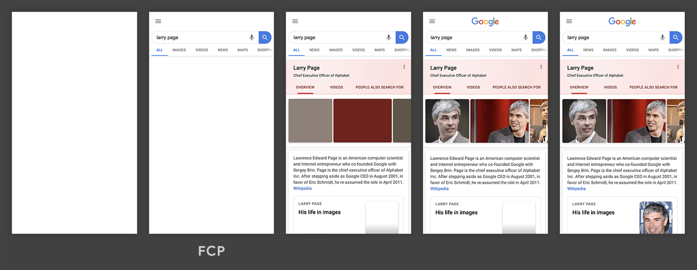

# Petite-vue

Привет, эта статья - "перевод документации и часто используемых примеров" для [petite-vue](https://github.com/vuejs/petite-vue) + ещё немного приколов и одна интересная практика.

## Зачем нужен petite-vue?
Petite-vue это 6ти килобайтное подмножество Vue, основной задачей которого, по словам Эвана, является Progressive Enchancement (как на пикче).



Petite-vue сильно похож на обычный Vue, в нём позаимствованы часто используемые директивы и есть возможность создавать кастомные. Синтаксис тоже напоминает стандартный вьюшный, но в силу легковесности фреймворка, довольно урезанный.
Очевидно, что petite-vue отлично получится использовать в местах, где бэкенд сам отдаёт htmlник, сгенерированный в ответ на запрос (хороший первый шаг для миграции фронта с php на что-то джаваскриптовое-SPAшное). Понять это можно из того, что фреймворк надо подключать с CDNа, и он не поставляется как npm пакет, взаимодействие планируется через инлайн-скрипты.

## Простые примеры
Пока мы ещё не начали спорить что же лучше, производительнее и выгоднее для архитектуры (ну ты же уже вроде научился не спорить о языках программирования :) ), давай посмотрим что тут можно поделать:
```html
<script src="https://unpkg.com/petite-vue" defer init></script>
<title>Petite Vue button</title>

<body v-scope="{num: 0}">
  <button @click="num++">
    +
  </button>

  {{ num }}
</body>
```
Удивительно, да? Этого кода (8 sloc) вполне достаточно чтобы что-то работало.
Смотри, первая строчка 
```html
<script src="https://unpkg.com/petite-vue" defer init></script>
```
просто подгружает на страницу библиотеку (атрибут *defer* позволяет сделать это после полной загрузки htmlя, а *init* сообщает petite-vue, что он может начинать парсить DOM и аккуратно его менять).
Вторая строчка - просто тайтл, думаю можно скипать ;).
А вот дальше начинаются приколы: в тег *body* я зачем-то добавил *v-scope* и присвоил ему какое-то странное значение.
```html
<body v-scope="{num: 0}">
  ...
</body>
```
*V-scope* это атририбут, который указывает Vue на этапе инициализации (да-да как раз тот *init*), что именно нужно инициализировать как новое приложение. Таких *v-scope*ов может быть много на странице и все они будут работать независимо друг от друга (ну или почти - расскажу через одну главу). Параметр, который мы передаём такой директивой - начальный стейт (состояние) приложения. Тут видно, что стейт содержит только поле *num* и по дефолту его значение равно *0*. В стейт можно класть что угодно: функции, массивы и объекты произвольной вложенности - как обычно. Если *v-scope* не присвоить значение - это тоже самое, что написать:
```html
<body v-scope="undefined">
  ...
</body>
```
Окей, с *v-scope*ом вроде разобрались, посмотрим, что там дальше:
```html
<button @click="num++">
  +
</button>
```
Смотри, button это известно что, давай поймём что же это за *@click*. Если ты уже знаком с Vue, можешь смело скипать следующий абзац :) .
Во Vue eventы добавляются к элементам вот так: "@<название eventа>". Для кнопки нам тут очевидно нужен "@click". Основной прикол этих директив - возможность тут же сделать допустим "@click.prevent" чтобы сделать preventDefault eventу или "@keyup.enter", чтобы событие срабатывало только для клавиши "enter". В качестве значения передаётся тело функции, которая будет исполнена, когда произойдёт необходимое событие, или название функции-хендлера как в обычном джаваскрипте (тоже принимает Event).
Здесь мы в качестве тела функции указали "num++", благодаря вью, в тело функции пробросится наш стейт и она вызовется с "with($data){}" (так, кстати этот стейт называется внутри либы, и если ты когда-то писал на полноценном вью - ловишь сейчас флешбеки). В общем да, значение num увеличится на единицу :) .

Теперь давай посмотрим на оставшуюся строку
```html
{{ num }}
```
Эта строка подставляет в текущее место htmlя рассчитанное значение от того, что находится в скобках. Туда тоже пробрасывается $data, так что мы можем спокойно вывести num.
Как же круто, что ты осилил эту главу. Этих знаний вполне хватит для того чтобы сделать что-то небольшое или поэкспериментировать с petite-vue.

## Todo приложение
Обычно, изучая джаваскрипт фреймворк ты создашь очередной туду-лист. Не хочу нарушать традиции :) . Приложение такого минимального скейла позволяет понять, как писать код модульно так, чтобы его потом можно было поддерживать.
Закину сразу бойлерплейт на котором всё будет держаться:
```html
<script src="https://unpkg.com/petite-vue" defer init></script>
<title>Petite Vue todo</title>

<body v-scope="/* сейчас допишу */">
  <input v-model="model.input"/>
  <button @click="addTodo">Add Todo</button>
  <template v-for="(todo, i) of todos" :key="i">
    <div>
      {{ todo }}
    </div>
  </template>
</body>
```
Тут сразу же появилось очень много всего, хотя *v-scope* я пока по-честному так и не написал.
Из нового привлекает внимание строка
```html
<input v-model="model.input"/>
```
Она рендерит input-элемент, который использует 2 way data binding с полем "model.input" в стейте. Простым языком, эта директива синхронизирует значение переменной "$data.model.input" со значением, написанным внутри inputа. (Тут я использовал "model.input", а не просто "input" только ради культуры кода, так как когда ты будешь делать сложную форму, моделей будет много и хорошо бы их хранить отдельным объектом).
Для кнопки я пока беру в долг завести функцию "addTodo".
Дальше идёт рендер списка с помощью *v-for*. Тут нужно обязательно прочитать [документацию по v-for во Vue](https://v3.ru.vuejs.org/ru/guide/list.html) самостоятельно, этот момент совпадает с оригинальным фреймворком, и сомневаюсь, что смогу объяснить это лучше.
Ну а теперь давай я допишу какой же будет *v-scope* и ты поймёшь, почему есть другие способы его инициализировать:
```html
<body v-scope="{todos: [], model: { input: '' }, addTodo(){ this.todos.push(this.model.input); this.model.input = ''}}">
  ...
</body>
```
Тут если внимательно приглядеться, можно увидеть всё что я взял в долг. Выглядит это, конечно, так себе.

Поэтому я провёл рефакторинг и теперь файл выглядит вот так:
```html
<script src="https://unpkg.com/petite-vue" defer init></script>
<title>Petite Vue todo</title>
<script>
  function generateConfig() {
    return {
      todos: [],
      model: { input: '' },
      addTodo() {
        this.todos.push(this.model.input)
        this.model.input = ''
      },
    }
  }
</script>
<body v-scope="generateConfig()">
  <input v-model="model.input"/>
  <button @click="addTodo">Add Todo</button>
  <template v-for="todo of todos">
    <div>
      {{ todo }}
    </div>
  </template>
</body>
```
Мысль очень проста - делаем глобальную функцию по генерации конфига и вызываем её там, где от нас требуют предъявить стейт для инициализации.

Но такого рефакторинга, конечно не хватает. По-хорошему нужно разделить элементы списка и корневой компонент и добавлением новой записи. Это необходимо для повышения модульности, переиспользования ... Можно сказать кучу красивых слов, но по сути мы хотим сделать код более понятным.
```html
<script src="https://unpkg.com/petite-vue" defer init></script>
<title>Petite Vue todo</title>

<body>
  <div v-scope="App()"></div>

  <template id="TodoTemplate">
      <input v-model="checked" type="checkbox"></input>
      <span
        :style="checked && `text-decoration: line-through`"
      >{{ text }}</span>
  </template>
  <script>
    function Todo(props) {
      return {
        $template: "#TodoTemplate",
        text: props,
        checked: false,
      }
    }
  </script>
  <style></style>

  <template id="AppTemplate">
    <input v-model="model.input"/>
    <button @click="addTodo">Add Todo</button>
    <template v-for="todo of todos">
      <div v-scope="Todo(todo)"></div>
    </template>
  </template>
  <script>
    function App() {
      return {
        $template: "#AppTemplate",
        todos: [],
        model: { input: '' },
        addTodo() {
          this.todos.push(this.model.input)
          this.model.input = ''
        },
      }
    }
  </script>
  <style></style>

</body>
```

Да, тут много чего произошло...
Во-первых, теперь я инициализирую petite-vue не на *body*, а на "рутовом" divе с конфигом *App*.
Во-вторых добавились какие-то templateы и сама структура поменялась (если вдруг знаешь как выглядят .vue файлы - наверное обо всём догадался).
В-третьих, как и обещал, компоненты усложнились внутри. Теперь компонент *App* рисует в цикле несколько самостоятельных компонентов *Todo*, которые имеют свой стейт, свои обработчики событий и даже входные параметры (т.н. пропсы "props").
К сожалению, для достижения такой абстракции понадобилось добавить templateы и ссылки на них из стейта в виде
```js
$template: "#AppTemplate"
```
Petite-vue использует этот селектор для поиска подходящего темплейта и использует его в качестве контента элемента, на который монтируется *App*.
Вместо указания айдишника, можно было бы передать внутрь строку типа
```js
$template: "<div> <h1> Hi </h1>  </div>"
```
Но это будет негативно сказываться на производительности (а это один из основных goalов petite-vue), потому что парсинг строки займёт больше времени, чем копирование существующих нод уже распарсенного DOMа (ну это уже из области очевидного).
Такой способ организации кода (как в "большом" Vue), мне кажется наиболее натуральным, разве что можно опустить рутовый темплейт, из-за того что он обычно используется только один раз. Не столько с целью оптимизации, сколько для более прозрачной структуры. Ну нормально.
## ES modules подход
Теперь необходимо обсудить подход, который предложил Эван. У него есть бонус в виде использования [встроенного стора](https://github.com/vuejs/vue-next/tree/master/packages/reactivity).
Это продолжение всё того же проекта с тудушками:
```html
<title>Petite Vue todo</title>

<body>
  <script type="module">
    import { createApp, nextTick, reactive } from "https://unpkg.com/petite-vue?module"

    const store = reactive({
      allTodos: [],
    })

    function Todo(props) {
      return {
        $template: "#TodoTemplate",
        text: props.todo.text,
        id: 'todo-' + props.i,
        checked: false,
        onCheck(e) {
          const globalTodo = store.allTodos
            .find(item => item.id === props.i)

          globalTodo.checked = e.target.checked
        },
      }
    }

    function App() {
      return {
        $template: "#AppTemplate",
        model: { input: '' },
        addTodo() {
          const newTodo = this.model.input
          if (!newTodo) return
          this.store.allTodos.push({
            text: newTodo,
            id: this.store.allTodos.length,
            checked: 0,
          })
          this.model.input = ''
        },
      }
    }

    createApp({ Todo, App, store }).mount()
  </script>

  <template id="TodoTemplate">
      <input
        v-model="checked"
        type="checkbox"
        @input="onCheck"
        :id="id"
      ></input>
      <label
        :for="id"
        :style="checked && `text-decoration: line-through`"
      >{{ text }}</label>
  </template>

  <template id="AppTemplate">
    <input v-model="model.input"/>
    <button @click="addTodo">Add Todo</button>
    <template v-for="(todo, i) of store.allTodos" :key="i">
      <div v-scope="Todo({ todo, i })"></div>
    </template>
    <div v-if="store.allTodos.reduce((a, b) => a + b.checked, 0) === store.allTodos.length">
      All Completed!
    </div>

  </template>

  <div v-scope="App()"></div>
</body>
```
Смотри, тут большинство концептов я уже объяснил - давай разберём только новое. Как видно, мы больше не подключаем petite-vue скрипт-тегом, теперь мы делаем это в стиле ES6 import (script type="module"). Так мы импортируем функции: *createApp*, *nextTick* и *reactive*. Так как мы не *init*им скрипт, теперь это нужно делать вручную. Это делает строка
```js
createApp({ Todo, App, store }).mount()
```
Внутрь этой функции мы передаём то, что я бы назвал VueGlobalObject (в исходном коде оно называется initialData, так что тут кажется норм отойти от канона ;) ). Так как ты знаешь, что снаружи script type="module" все Referenceы к переменным будут ReferenceErrorами, VueGlobalObject это объект with с которым выполняется в аргументе *v-scope*. Это как $data, но влияет на весь petite-vue контекст, позволяя уйти от глобальных переменных.
Ещё, как ты мог заметить, вызывается метод ".mount()". Ему можно передать параметр, чтобы ограничить контекст только на потомство какого-то элемента (без аргумента = без ограничений) например "createApp().mount('#navigation')".
Второе значимое изменение - *store*. Он создаётся как 
```js
const store = reactive({
  allTodos: [],
})
```
Если не слишком вдаваться - это просто глобальная переменная, обёрнутая в reactive(), которая нормально работает с petite-vue.
Если вдаваться: попробуй создать вместо этого обычную глобальную переменную и передать её также в VueGlobalObject. После этого попробуй её обновить. Её отображаемое значение не изменится. Другими словами, reactive заставляет petite-vue перерисовывать все компоненты в которых есть вхождение данной глобальной переменной. Плюс там под капотом десятки оптимизаций, которые позволяют достигать "скорость!!! я скорость!!!".
## Итоги
Очевидно, что эта либа позволяет очень круто проектировать небольшие проекты/что-то с упором на progressive enchancement. Из явных конкурентов есть разве что preact, но не знаю насколько имеет смысл их сравнивать. Это как сравнивать старших братьев - Vue и React. Могу точно сказать, что petite-vue как первый фреймворк, как переезд с php на "норм фронт" и в целом как машина для адской оптимизации ttl - офигенно крутое, интересное, новое решение. Зная поддержку экосистемы Vue и особенность данного проекта, можно предсказать, что какое-то развитие там будет.
Для меня ещё остаётся открытым выбор между двумя разными подходами (ES6 modules vs original Vue), их плюсы и минусы довольно неочевидны в рамках одного index.html. Так что было бы круто узнать мнение кого-то покруче меня про это ;)


Мои примеры можно посмотреть [тут](https://github.com/notTGY/einstain/tree/master/petite-vue-example)