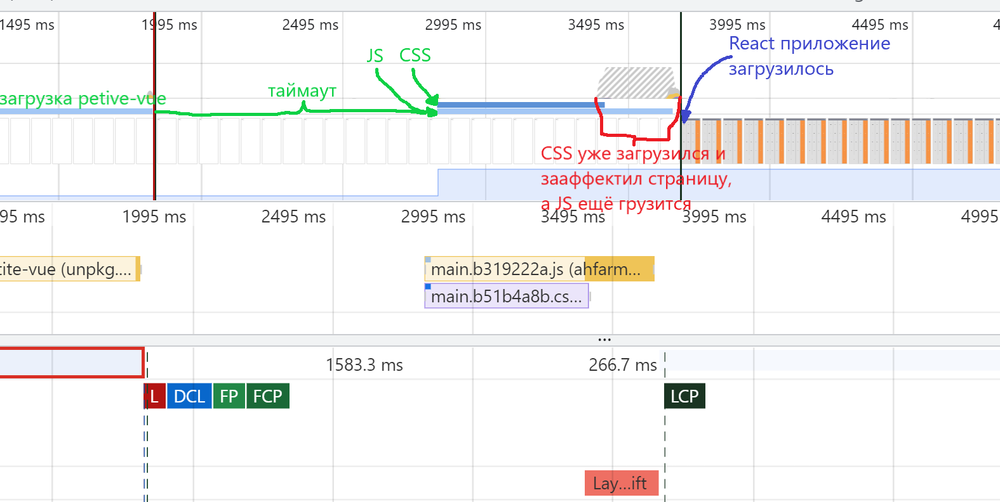

# Прогрессивный Petite-vue

Привет 👋, это статья про progressive enchancement с помощью petite-vue. Тут я расскажу про его прикольные фичи (как отдельного инструмента, так и в составе Vue). Конечно, было бы прикольно, если бы ты прочитал(а) [предыдущую статью по Petite-vue](https://habr.com/ru/post/593877/), там много чего расказано про **либу** в целом, есть какие-то базовые примеры, но "it's okay" не читать её. Если соображаешь что-то во Vue - тут не так уж и много отличий (о которых, помимо прочего, тут и пойдёт речь).

Ну, я надеюсь ты "ready to action", так что давай сразу запрыгнем в код.

## Простая реализация progressive enchancementа

```html
<title> Petite Vue Progressive Enchancement </title>
<style>
  [v-cloak] {display:none}
  body { background: #fff!important }
</style>

<script src="https://unpkg.com/petite-vue" defer init></script>
<script>
  const SCRIPTS = [
    "https://ahfarmer.github.io/calculator/static/js/main.b319222a.js",
  ]
  const CSS = [
    "https://ahfarmer.github.io/calculator/static/css/main.b51b4a8b.css",
  ]

  function embedScript(mount, src) {
    const tag = document.createElement("script")
    tag.src = src
    return mount.appendChild(tag)
  }
  function embedCSS(mount, src) {
    const tag = document.createElement("link")
    tag.rel = "stylesheet"
    tag.href = src
    return mount.appendChild(tag)
  }
  function tryToLoadSPA() {
    setTimeout(loadSPA, 1000)
  }
  function loadSPA() {
    const mount = document.getElementsByTagName("head")[0]
    SCRIPTS.map(src => embedScript(mount, src))
    CSS.map(src => embedCSS(mount, src))
  }
</script>

<body>
  <div id="root" v-scope="{num: 0}" v-cloak @mounted="tryToLoadSPA">
    {{ num }} <button @click="num++">+</button>
  </div>
</body>
```
Тут, наверное, очень много всего непонятного. Наверное поможет если ты зайдёшь сразу посмотреть на [готовое приложение](https://nottgy.github.io/einstain/petite-vue-example/progressive-enchancement/naive.html), потыкаешься.
Что происходит по сути: пока не загрузился petite-vue - ничего не показываем, после загрузки petite-vue - показываем *приложение-counter* и ставим на загрузку стили и скрипты **мощного** React приложения через N (=1) секунд, после загрузки React приложения - petite-vue пропадает.
В качестве подопытного React приложения я взял (первая ссылка из документации :)) [вот этот калькулятор](https://github.com/ahfarmer/calculator)

Так, ну а теперь давай разбираться, что же тут написано и как можно это улучшить.
```html
<style>
  [v-cloak] {display:none}
  body { background: #fff!important }
</style>
```
Атрибут *v-cloak* позволяет скрывать часть дерева до момента, когда petite-vue её распарсил. По сути можно задать там любой стиль, но самое логичное - скрывать элемент, который не будет работать как ожидает пользователь (эта директива есть и в обычном Vue). Ещё я задал белый бэкграунд, так как стили калькулятора его меняют, а я хочу смотреть, остаётся ли страница responsive пока я подгружаю скрипты и стили (просто на чёрном не видно чёрный текст моего счётчика (короче забей)).

После стилей видно данный джаваскрипт:
```js
const SCRIPTS = [
  "https://ahfarmer.github.io/calculator/static/js/main.b319222a.js",
]
const CSS = [
  "https://ahfarmer.github.io/calculator/static/css/main.b51b4a8b.css",
]

function embedScript(mount, src) {
  const tag = document.createElement("script")
  tag.src = src
  return mount.appendChild(tag)
}
function embedCSS(mount, src) {
  const tag = document.createElement("link")
  tag.rel = "stylesheet"
  tag.href = src
  return mount.appendChild(tag)
}
function tryToLoadSPA() {
  setTimeout(loadSPA, 1000)
}
function loadSPA() {
  const mount = document.getElementsByTagName("head")[0]
  SCRIPTS.map(src => embedScript(mount, src))
  CSS.map(src => embedCSS(mount, src))
}
```

По сути тут создаётся глобальная функция *tryToLoadSPA*, которая будет загружать большое SPA приложение опираясь на какую-то логику (у меня стоит таймаут в демонстрационных целях). Туда можно поставить данные *performance*, чтобы грузить SPA в зависимости от FCP или TTI или ещё чего угодно... Можно на этом моменте делать всплывающее окно, в котором спрашивать пользователя или он хочет загрузить **расширенную версию сайта**. В общем суть понятна. Костыли для асинхронной загрузки jsа и cssок я взял с [stackoverflow](https://stackoverflow.com/questions/19737031/loading-scripts-after-page-load).

Ну и заключающий кусок - уже бородатый counter:
```html
<div id="root" v-scope="{num: 0}" v-cloak @mounted="tryToLoadSPA">
  {{ num }} <button @click="num++">+</button>
</div>
```

Если вдруг впервые видишь *v-scope* - это фича исключительно petite-vue. По сути ты задаёшь *$data* поле, одновременно инициализируя дочернюю часть DOM дерева как Vue компонент (подробнее в статье x).
Тут же очередная эксклюзивная штука - *@mounted*. Это директива, которая исполнит JS код каждый раз, когда компонент будет замаунтен (в нашем случае только 1 раз). В обычном Vue это поле *mounted* структурки компонента. По аналогии с другими названиями директив может показаться, что есть event *onmounted*, но это не так - только petite-vue может обработать/послать это событие. Точно также есть событие *@unmounted*, которое срабатывает когда элемент удаляется из дерева.

Заметим, что данный элемент имеет *id="root"*. Это не случайно - когда придёт React приложение, оно перетрёт всё что мы пишем на petite-vue и не возникнет никаких артефактов.

Давай посмотрим на получившийся график производительности


## v-effect
Конечно, стоит согласиться, что в предыдущем примере мы получили очень мощный фундамент для progressive приложения, но я всё-таки не соглашусь. Первый вопрос, который покажет несостоятельность системы - я использую колбек *@mounted*, а что если он уже будет занят???

Давай попробуем придумать решение с помощью ещё одного эксклюзива Petite-vue *v-effect*. Это очень мощная директива, которая позволяет исполнять реактивные скрипты.

Если ты знаешь про *useEffect* из Reactа, то *v-effect* это такой *useEffect* на минималках, который сам определяет массив зависимостей и прогоняет инлайн скрипт при изменении какой-то зависимости. Давай посмотрим [пример из документации](https://github.com/vuejs/petite-vue#v-effect):
```html
<div v-scope="{ count: 0 }">
  <div v-effect="$el.textContent = count"></div>
  <button @click="count++">++</button>
</div>
```

Тут массив зависимостей (входные/внешние переменные) определяется как *[ $data.count ]* и при каждом обновлении этой переменной скриптик *$el.textContent = count* будет снова и снова исполняться.

Давай теперь применим этот инструмент для нашего прогрессивного примера:
```html
<div
  id="root"
  v-scope="{num: 0}"
  v-cloak
  v-effect="tryToLoadSPA()"
  @mounted="console.log('hi')"
>
  {{ num }} <button @click="num++">+</button>
</div>
```

Теперь мы получили тот же результат, что и в первом решении, но имеем свободный колбек для *@mounted*.


Можно удостоверится что этот пример рабочий на [странице](https://nottgy.github.io/einstain/petite-vue-example/progressive-enchancement/veffect.html).

## Кастомные директивы
Ну а что если я хочу использовать и *v-effect* и *@mounted*??? Неужели всё-таки придётся писать костыльно? А что если я хочу автоматически собирать приложение, а не прописывать каждый раз entrypointы вручную прямо в Джаваскрипте?

В таком случае можно сделать кастомную директиву. В обычном Vue это тоже возможно, но там, очевидно, другой набор возможностей :). В общем давай попробуем сделать хоть что-то - потом разберёмся.

```html
<title> Petite Vue Progressive Enchancement </title>
<style>
  [v-cloak] {display:none}
  body { background: #fff!important }
</style>

<script type="module">
  import { createApp } from "https://unpkg.com/petite-vue?module"

  const SCRIPTS = [
    "https://ahfarmer.github.io/calculator/static/js/main.b319222a.js",
  ]
  const CSS = [
    "https://ahfarmer.github.io/calculator/static/css/main.b51b4a8b.css",
  ]

  function embedScript(mount, src) {
    const tag = document.createElement("script")
    tag.src = src
    return mount.appendChild(tag)
  }
  function embedCSS(mount, src) {
    const tag = document.createElement("link")
    tag.href = src
    tag.rel = "stylesheet"
    return mount.appendChild(tag)
  }
  function tryToLoadSPA() {
    setTimeout(loadSPA, 1000)
  }
  function loadSPA() {
    const mount = document.getElementsByTagName("head")[0]
    SCRIPTS.map(src => embedScript(mount, src))
    CSS.map(src => embedCSS(mount, src))
  }

  function App() {
    return { num: 0 }
  }

  const progressiveDirective = (ctx) => {
    tryToLoadSPA()
  }

  createApp({ App, tryToLoadSPA })
    .directive('progressive', progressiveDirective)
    .mount()
</script>

<body>
  <div id="root" v-scope="App()" v-cloak v-progressive>
    {{ num }} <button @click="num++">+</button>
  </div>
</body>
```

Вот, мы заменили *v-effect* и *@mounted* на *v-progressive*. Это директива, которую мы добавили вот так:
```js
const progressiveDirective = (ctx) => {
  tryToLoadSPA()
}

createApp({ App, tryToLoadSPA })
  .directive('progressive', progressiveDirective)
  .mount()
```
У нас очень простой случай - нам нужно исполнить что-то на mountе элемента, к которому привязана директива, поэтому мы не используем *ctx* контекст доступный директиве, а просто вызываем там необходимую функцию.
Но в *ctx* передаётся куча полезностей ([из доки](https://github.com/vuejs/petite-vue#custom-directives)):
```js
const myDirective = (ctx) => {
  // элемент, на который привязана директива
  ctx.el

  // необработанное значение, передающееся в директиву
  // для v-my-dir="x" это будет "x"
  ctx.exp

  // дополнительный аргумент через ":"
  // v-my-dir:foo -> "foo"
  ctx.arg

  // массив модификаторов
  // v-my-dir.mod -> { mod: true }
  ctx.modifiers

  // можно вычислить выражение ctx.exp
  ctx.get()

  // можно вычислить произвольное выражение
  ctx.get(`${ctx.exp} + 10`)

  ctx.effect(() => {
    // это аналог v-effect, будет вызыватся при изменении значения ctx.get()
    console.log(ctx.get())
  })

  return () => {
    // колбек, который вызывается при unmountе элемента
  }
}

// добавляем директиву к глобальной области petite-vue
createApp().directive('my-dir', myDirective).mount()
```

Можно усовершенствовать наш пример если не хардкодить константы *SCRIPTS* и *CSS*, а передавать внутрь директивы *v-progressive* массив entrypointов и автоматически всё парсить и подгружать (cssки отдельно от jsа). Но это очень много кода, который не хочется просто вставлять сюда - идея понятна :).

## Кастомные ограничители

Вроде разобрались со всем что касается расширяемости, теперь наметилась ещё одна проблема: я использую mustache/handlebars/jinja/ещё что-то где уже есть ограничители *{{* и *}}*.

В таком случае можно изменить ограничители petite-vue, передав...
```js
createApp({
  $delimiters: ['$<', '>$']
}).mount()
```
На месте *$<* и *>$* естественно может быть что угодно. Лучше чтобы длина была покороче и в шаблоне такие символы встречались не слишком часто (нужно подумать о скорости поиска в строке :) ).

## Заключение.min.js

Не хочу что-то тут писать, потому что рассказал не про всё что есть в petite-vue. Однако рассказал обо всех уникальных (отличительных от Vue) особенностях, которые позволяют строиться прямо поверх DOMа быстрее и эффективнее. В общем нормально... 

Мои примеры можно посмотреть [тут](https://github.com/notTGY/einstain/tree/master/petite-vue-example/progressive-enchancement).
